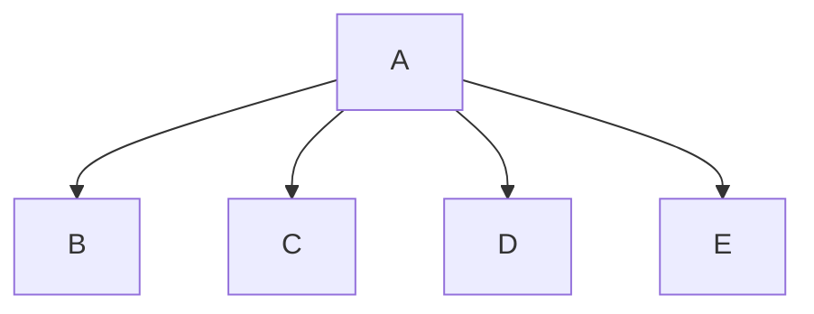

# Chapter 6 team project
Gage, Ethan

## Travel Expenses Description

### <program_name> Flowchart

#### Function Diagrams

| `daysOnTrip`    |               |  author     |
| ------------------ | ------------- | ------------ |
| Accepts no arguments |
| Takes input for the number of days spent on the trip |
|and returns it |
***

| `departure`    |               |     author   |
| ------------------ | ------------- | ------------ |
| Accepts no arguments|
| Takes input for the departure time|
| and returns it|
***

| `arrival`    |               |     author   |
| ------------------ | ------------- | ------------ |
| Accepts no arguments|
| Takes input for the arrival time|
| and retunrs it|
***

|  `roundTrip` | | author |
| -- | -- | -- |
| Accepts no arguments |
| Takes input for the cost of a round trip |
| and returns it to main |
***

| `carRentals` | | author |
| -- | -- | -- |
| Accepts no arguments |
| Takes input to see if car rentals were used |
| if so, it takes input for the cost of them |
| if 
